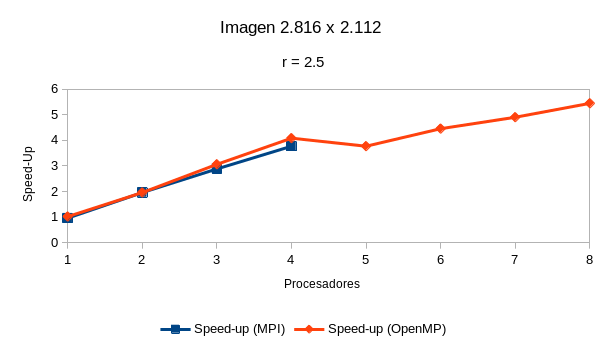

# Práctica 4 - Computación en la Nube

- **Nombre**: Pierre Simon Callist Yannick Tondreau
- **Repositorio Git**: [https://github.com/PierreSimT/pr_cn/tree/master/p4](https://github.com/PierreSimT/pr_cn/tree/master/p4)
- **Máster Ingeniería Informática - Universidad de La Laguna**

## 1. Desarrolla una versión en CUDA del código que has desarrollado en la práctica 3 para el procesamiento de imágenes

La función encargada en aplicar el filtro sobre la imagen pasará a ser el kernel CUDA que se ejecutará en la GPU. La función es la siguiente:

```cpp
__global__ void gaussBlurCUDA(uchar * src, uchar * result, size_t filas, size_t columnas, float radius) {

    int i = blockIdx.x * blockDim.x + threadIdx.x;

    double rs = ceil(radius * 2.57);
    if ( i < filas ) {
        for (int j = 0; j < columnas; j++) {       
            float val = 0, sum = 0;
            for (int t = i - rs; t < i + rs + 1; t++)
            {
                for (int s = j - rs; s < j + rs + 1; s++)
                {
                    int x = min((int)columnas - 1, max(0, s));
                    int y = min((int)filas - 1, max(0, t));

                    float dsq = (s - j) * (s - j) + (t - i) * (t - i);
                    float weight = exp(-dsq / (2.0 * radius * radius)) / (M_PI * 2.0 * radius * radius);

                    val += src[y * columnas + x] * weight;
                    sum += weight;
                }

                result[i * columnas + j] = round(val / sum);
            }
        }
    }

}
```

La matriz de entrada y de salida se han modificado para trabajar con punteros en vez de usar objetos y clases de la librería OpenCV dentro del kernel.

Para ejecutar el kernel se han realizado una serie de pasos.

1. Preparar los buffers con los que va a trabajar la GPU

```cpp
uchar * src;
uchar * result;

cudaMalloc(&src, img.total() * sizeof(uchar));
cudaMalloc(&result, img.total() * sizeof(uchar));
cudaMemcpy(src, img.data, img.total() * sizeof(uchar), cudaMemcpyHostToDevice);
```

2. Ejecutamos el kernel y traemos el resultado a la memoria de la CPU

```cpp
int numBloques = 16;
dim3 threadsPerBlock(img.rows / numBloques);
gaussBlurCUDA<<<numBloques, threadsPerBlock>>>(src, result, img.rows, img.cols, radius);
cudaMemcpy(resultCPU->data, result, img.total(), cudaMemcpyDeviceToHost);
```

3. Liberamos la memoria

```cpp
cudaFree(src);
cudaFree(result);
```

### Versión OpenCL

Adicionalmente se ha desarrollado una versión OpenCL para que sea compatible no solo con GPU Nvidia, pero con cualquier GPU.

El kernel de OpenCL es el singuiente:

```cpp
kernel void gaussBlur(global uchar *src, global uchar *result, int filas, int columnas, float radius) {

    int i = get_global_id(0);

    float rs = ceil(radius * 2.57);
    if ( i < filas ) {
        for (int j = 0; j < columnas; j++) {       
            float val = 0, sum = 0;
            for (int t = i - rs; t < i + rs + 1; t++)
            {
                for (int s = j - rs; s < j + rs + 1; s++)
                {
                    int x = min((int)columnas - 1, max(0, s));
                    int y = min((int)filas - 1, max(0, t));

                    float dsq = (s - j) * (s - j) + (t - i) * (t - i);
                    float weight = exp(-dsq / (2.0 * radius * radius)) / (M_PI * 2.0 * radius * radius);

                    val += src[y * columnas + x] * weight;
                    sum += weight;
                }

                result[i * columnas + j] = round(val / sum);
            }
        }
    }

}
```

Los pasos que se han de realizar para ejecutar el kernel son técnicamente los mismos, exceptuando por la inicialización del OpenCL.

## 2. Analiza el rendimiento de las tres versiones paralelas que has desarrollado.

A continuación se mostrarán las gráficas obtenidas de cada una de las ejecuciones de los programas cambiando algunas variables. Para ello, se han realizado pruebas con diferentes radios para la aplicación del filtro y con diferentes imágenes.

### Análisis 1

* Imagen usada: `sample3.png` 2816 x 2112
* Radio: `2.5`

Los tiempos de ejecución (en segundos) obtenidos por cada una de los programas son los siguientes:

|              |   1   |  2 |  3 |  4 |  5 |  6 |  7 | 8 |
|:------------:|:-----:|:--:|:--:|:--:|:--:|:--:|:--:|:-:|
|  **Secuencial**  |   49  |    |    |    |    |    |    |   |
|      **MPI**     |   51  | 25 | 17 | 13 |    |    |    |   |
|    **OpenMP**    |   48  | 25 | 16 | 12 | 13 | 11 | 10 | 9 |
| **GPU (OpenCL)** | 0.212 |    |    |    |    |    |    |   |


Para dichos valores, la aceleración (speed-up) obtenida es la siguiente:

|                       |    1   |   2  |   3  |   4   |   5  |   6  |  7  |   8  |
|:---------------------:|:------:|:----:|:----:|:-----:|:----:|:----:|:---:|:----:|
|   **Speed-up (MPI)**  |  0.96  | 1.96 | 2.88 |  3.77 |      |      |     |      |
| **Speed-up (OpenMP)** |  1.02  | 1.96 | 3.06 |  4.08 | 3.77 | 4.45 | 4.9 | 5.44 |
|   **Speed-up (GPU)**  | 231.13 |      |      |       |      |      |     |      |



La eficiencia obtenida es la siguiente:

|                      |     1     |  2 |    3   |    4   |   5   |   6   |  7 |   8   |
|:--------------------:|:---------:|:--:|:------:|:------:|:-----:|:-----:|:--:|:-----:|
|   **Eficiencia (MPI)**   |    96.08  | 98 |  96.08 |  94.23 |       |       |    |       |
| **Eficiencia (OpenMP)** |   102.08  | 98 | 102.08 | 102.08 | 75.38 | 74.24 | 70 | 68.06 |
|   **Eficiencia (GPU)**   |  23113.21 |    |        |        |       |       |    |       |


### Análisis 2

* Imagen usada: `sample3.png` 2816 x 2112
* Radio: `5.0`

Los tiempos de ejecución (en segundos) obtenidos por cada una de los programas son los siguientes:

|              |   1   |  2 |  3 |  4 |  5 |  6 |  7 |  8 |
|:------------:|:-----:|:--:|:--:|:--:|:--:|:--:|:--:|:--:|
|  **Secuencial**  |  155  |    |    |    |    |    |    |    |
|      **MPI**     |  162  | 81 | 56 | 45 |    |    |    |    |
|    **OpenMP**    |  154  | 77 | 52 | 40 | 43 | 36 | 33 | 30 |
| **GPU (OpenCL)** | 0.637 |    |    |    |    |    |    |    |


Para dichos valores, la aceleración (speed-up) obtenida es la siguiente:

|                   |    1   |   2   |   3  |   4  |   5  |   6  |  7  |   8  |
|:-----------------:|:------:|:-----:|:----:|:----:|:----:|:----:|:---:|:----:|
|   **Speed-up (MPI)**  |   0.96 |  1.91 | 2.77 | 3.44 |      |      |     |      |
| **Speed-up (OpenMP)** |  1.01  |  2.01 | 2.98 | 3.88 | 3.60 | 4.31 | 4.7 | 5.17 |
|   **Speed-up (GPU)**  | 243.31 |       |      |      |      |      |     |      |


La eficiencia obtenida es la siguiente:

|                      |     1    |    2   |   3   |   4   |   5   |   6   |   7  |   8   |
|:--------------------:|:--------:|:------:|:-----:|:-----:|:-----:|:-----:|:----:|:-----:|
|   **Eficiencia (MPI)**   |   95.68  |  95.68 | 92.26 | 86.11 |       |       |      |       |
| **Eficiencia (OpenMP)** |   100.65 | 100.65 | 99.36 | 96.87 | 72.09 | 71.76 | 67.1 | 64.58 |
|   **Eficiencia (GPU)**   | 24332.81 |        |       |       |       |       |      |       |


### Análisis 3

* Imagen usada: `sample3.png` 2816 x 2112
* Radio: `10.0`

Los tiempos de ejecución (en segundos) obtenidos por cada una de los programas son los siguientes:

|              |   1   |  2  |  3  |  4  |  5  |  6  |  7  |  8  |
|:------------:|:-----:|:---:|:---:|:---:|:---:|:---:|:---:|:---:|
|  **Secuencial**  |  589  |     |     |     |     |     |     |     |
|      **MPI**     |  601  | 301 | 205 | 158 |     |     |     |     |
|    **OpenMP**    |  585  | 299 | 200 | 153 | 163 | 139 | 129 | 117 |
| **GPU (OpenCL)** | 2.344 |     |     |     |     |     |     |     |


Para dichos valores, la aceleración (speed-up) obtenida es la siguiente:

|                   |    1   |   2  |   3  |   4  |   5  |   6  |   7  |   8  |
|:-----------------:|:------:|:----:|:----:|:----:|:----:|:----:|:----:|:----:|
| **Speed-up (MPI)**    | 0.98   | 1.96 | 2.87 | 3.73 |      |      |      |      |
| **Speed-up (OpenMP)** | 1.01   | 1.97 | 2.95 | 3.85 | 3.61 | 4.24 | 4.57 | 5.03 |
| **Speed-up (GPU)**    | 251.28 |      |      |      |      |      |      |      |


La eficiencia obtenida es la siguiente:

|                      |     1    |   2   |   3   |   4   |   5   |   6   |   7   |   8   |
|:--------------------:|:--------:|:-----:|:-----:|:-----:|:-----:|:-----:|:-----:|:-----:|
| **Eficiencia (MPI)**     | 98.00    | 97.84 | 95.77 | 93.2  |       |       |       |       |
| **Eficiencia (OpenMP)** | 100.68   | 98.49 | 98.17 | 96.24 | 72.27 | 70.62 | 65.23 | 62.93 |
| **Eficiencia (GPU)**     | 25127.99 |       |       |       |       |       |       |       |


### Análisis 4

* Imagen usada: `imagen.jpeg` 940 x 627
* Radio: `2.5`

Los tiempos de ejecución (en segundos) obtenidos por cada una de los programas son los siguientes:

|              |   1   | 2 |   3  |   4  |   5  |   6   |   7   |   8   |
|:------------:|:-----:|:-:|:----:|:----:|:----:|:-----:|:-----:|:-----:|
| **Secuencial**   | 5     |   |      |      |      |       |       |       |
| **MPI**          | 5     | 3 | 2    | 1    |      |       |       |       |
| **OpenMP**       | 4     | 2 | 1.73 | 1.34 | 1.41 | 1.192 | 1.091 | 1.022 |
| **GPU (OpenCL)** | 0.065 |   |      |      |      |       |       |       |


Para dichos valores, la aceleración (speed-up) obtenida es la siguiente:

|                   |   1   |   2  |   3  |   4  |   5  |   6  |   7  |   8  |
|:-----------------:|:-----:|:----:|:----:|:----:|:----:|:----:|:----:|:----:|
| **Speed-up (MPI)**    | 1     | 1.67 | 2.5  | 5    |      |      |      |      |
| **Speed-up (OpenMP)** | 1.25  | 2.5  | 2.89 | 3.73 | 3.55 | 4.19 | 4.58 | 4.89 |
| **Speed-up (GPU)**    | 76.92 |      |      |      |      |      |      |      |


La eficiencia obtenida es la siguiente:

|                      |    1    |   2   |   3   |   4   |   5   |   6   |   7   |   8   |
|:--------------------:|:-------:|:-----:|:-----:|:-----:|:-----:|:-----:|:-----:|:-----:|
| **Eficiencia (MPI)**     | 100     | 83.33 | 83.33 | 125   |       |       |       |       |
| **Eficiencia (OpenMP)** | 125     | 125   | 96.34 | 93.28 | 70.92 | 69.91 | 65.47 | 61.15 |
| **Eficiencia (GPU)**     | 7692.31 |       |       |       |       |       |       |       |


### Análisis 5

* Imagen usada: `imagen.jpeg` 940 x 627
* Radio: `5.0`

Los tiempos de ejecución (en segundos) obtenidos por cada una de los programas son los siguientes:

|              |   1   |   2   | 3 | 4 | 5 | 6 | 7 | 8 |
|:------------:|:-----:|:-----:|:-:|:-:|:-:|:-:|:-:|:-:|
| **Secuencial**   | 15    |       |   |   |   |   |   |   |
| **MPI**          | 16    | 8     | 5 | 4 |   |   |   |   |
| **OpenMP**       | 15    | 7     | 5 | 4 | 4 | 3 | 3 | 3 |
| **GPU (OpenCL)** | 0.194 |       |   |   |   |   |   |   |


Para dichos valores, la aceleración (speed-up) obtenida es la siguiente:

|                   |   1   |   2  | 3 |   4  |   5  | 6 | 7 | 8 |
|:-----------------:|:-----:|:----:|:-:|:----:|:----:|:-:|:-:|:-:|
| **Speed-up (MPI)**    | 0.94  | 1.88 | 3 | 3.75 |      |   |   |   |
| **Speed-up (OpenMP)** | 1     | 2.14 | 3 | 3.75 | 3.75 | 5 | 5 | 5 |
| **Speed-up (GPU)**    | 77.32 |      |   |      |      |   |   |   |


La eficiencia obtenida es la siguiente:

|                     |    1    |    2   |  3  |   4   |  5 |   6   |   7   |   8  |
|:-------------------:|:-------:|:------:|:---:|:-----:|:--:|:-----:|:-----:|:----:|
| **Eficiencia (MPI)**    | 93.75   | 93.75  | 100 | 93.75 |    |       |       |      |
| **Eficiencia (OpenMP)** | 100     | 107.14 | 100 | 93.75 | 75 | 83.33 | 71.43 | 62.5 |
| **Eficiencia (GPU)**    | 7731.96 |        |     |       |    |       |       |      |


### Análisis 6

* Imagen usada: `imagen.jpeg` 940 x 627
* Radio: `10.0`

Los tiempos de ejecución (en segundos) obtenidos por cada una de los programas son los siguientes:

|              |   1   |  2 |  3 |  4 |  5 |  6 |  7 |  8 |
|:------------:|:-----:|:--:|:--:|:--:|:--:|:--:|:--:|:--:|
| **Secuencial**   | 59    |    |    |    |    |    |    |    |
| **MPI**          | 59    | 30 | 20 | 16 |    |    |    |    |
| **OpenMP**       | 58    | 29 | 20 | 15 | 16 | 13 | 12 | 11 |
| **GPU (OpenCL)** | 0.727 |    |    |    |    |    |    |    |


Para dichos valores, la aceleración (speed-up) obtenida es la siguiente:

|                   |   1   |   2  |   3  |   4  |   5  |   6  |   7  |   8  |
|:-----------------:|:-----:|:----:|:----:|:----:|:----:|:----:|:----:|:----:|
| **Speed-up (MPI)**    | 1     | 1.97 | 2.95 | 3.69 |      |      |      |      |
| **Speed-up (OpenMP)** | 1.017 | 2.03 | 2.95 | 3.93 | 3.69 | 4.54 | 4.92 | 5.36 |
| **Speed-up (GPU)**    | 81.16 |      |      |      |      |      |      |      |


La eficiencia obtenida es la siguiente:

|                     |    1    |    2   |   3   |   4   |   5   |   6   |   7   |   8   |
|:-------------------:|:-------:|:------:|:-----:|:-----:|:-----:|:-----:|:-----:|:-----:|
| **Eficiencia (MPI)**    | 100     | 98.33  | 98.33 | 92.19 |       |       |       |       |
| **Eficiencia (OpenMP)** | 101.72  | 101.72 | 98.33 | 98.33 | 73.75 | 75.64 | 70.24 | 67.05 |
| **Eficiencia (GPU)**    | 8115.54 |        |       |       |       |       |       |       |


## Conclusión

Con los resultados obtenidos podemos afirmar que usar el algoritmo que se ejecuta en la tarjeta gráfica es la mejor opción. La aceleración 
y eficiencia obtenida supera por alto los resultados obtenidos en los algoritmos que se ejecutan en CPU. Por ello, la conlusión estará más enfocada en
los algoritmos ejecutados en CPU.

Los algoritmos han sido ejecutados variando la imagen y el tamaño del radio, afectando el algoritmo de la siguiente forma:

* Con una imagen más grande el algoritmo deberá recorrer más píxeles, por lo tanto durando más.
* Con un radio mayor, el numero de píxeles vecinos usados para el filtrado también es mayor.

Cada una de las pruebas presentan una gráfica similar, en las cuales podemos observar que a partir de cuatro procesadores el beneficio que se obtiene de aumentar el número de procesadores es poco.

### Aceleración

En el caso de la aceleración a medida que subimos el número de procesadores el valor de la aceleración aumenta de forma lineal, pero llegados a los cuatro procesadores el aumento de aceleración es menor y se nos presenta la duda de si nos beneficia usar más de cuatro procesadores para este programa.

A continuación se muestra la aceleración media de cada una de las ejecuciones.

|                   |    1   |   2  |   3  |   4  |   5  |   6  |   7  |   8  |
|:-----------------:|:------:|:----:|:----:|:----:|:----:|:----:|:----:|:----:|
| **Speed-up (MPI)**    | 0.97   | 1.89 | 2.83 | 3.9  |      |      |      |      |
| **Speed-up (OpenMP)** | 1.05   | 2.10 | 2.97 | 3.87 | 3.66 | 4.46 | 4.78 | 5.15 |
| **Speed-up (GPU)**    | 160.19 |      |      |      |      |      |      |      |


## Eficiencia

En el caso de la eficiencia, el valor permanecía constante rozando el 100% de eficiencia, pero una vez que se llega a usar más de cuatro procesadores, este valor cae dado a que no se obtiene el mismo beneficio que antes al subir el número de procesadores.

A continuación se muestra la eficiencia media de cada una de las ejecuciones.

|                     |     1    |    2   |   3   |   4   |   5   |   6   |   7   |   8   |
|:-------------------:|:--------:|:------:|:-----:|:-----:|:-----:|:-----:|:-----:|:-----:|
| **Eficiencia (MPI)**    | 97.25    | 94.49  | 94.3  | 97.41 |       |       |       |       |
| **Eficiencia (OpenMP)** | 105.02   | 105.17 | 99.05 | 96.76 | 73.23 | 74.25 | 68.24 | 64.37 |
| **Eficiencia (GPU)**    | 16018.97 |        |       |       |       |       |       |       |


Tomando estos valores en cuenta, podemos concluir que para este programa el uso de más de cuatro procesadores nos aporta un benificio muy bajo. La razón por la cual los beneficios no aumentan de igual forma que lo hacen a menor número de procesadores se puede deber a diferentes factores, como lo son los siguientes:

* Accesos a memoria
* Tiempos de comunicación entre procesadores
* Código secuencial que debe ejecutarse de forma secuencial

En cualquier caso, el uso de una GPU para esta tarea presenta un beneficio mucho mayor que usar la CPU.