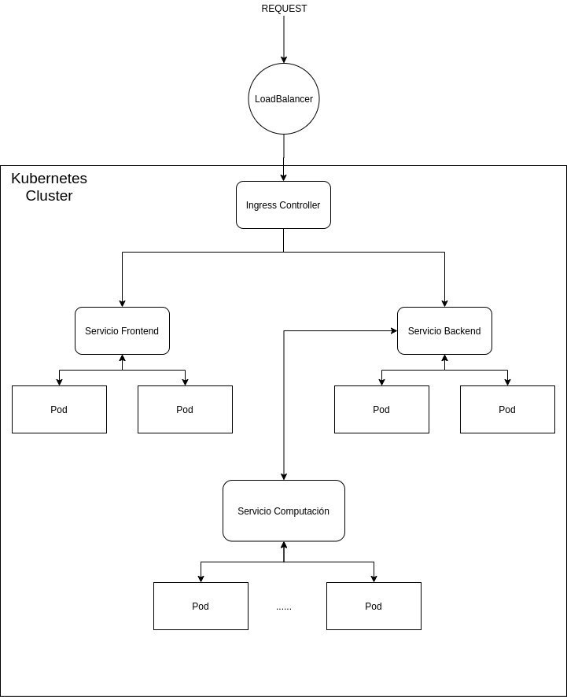
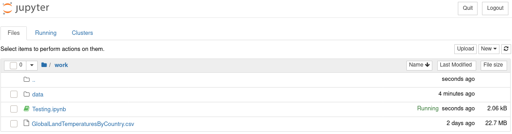
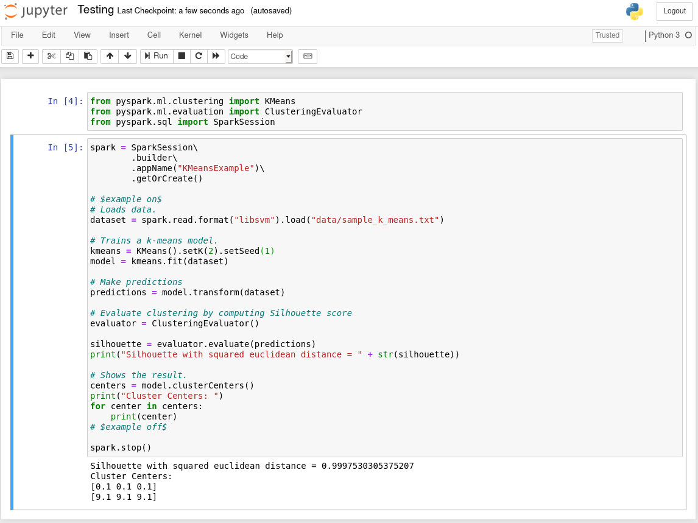
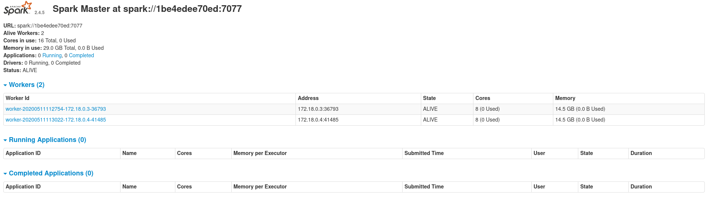
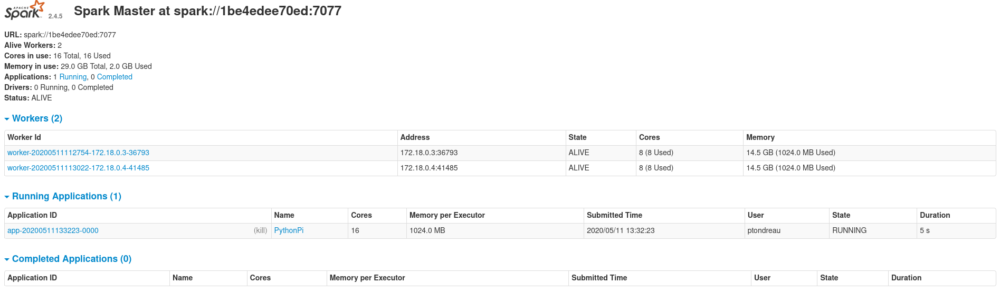
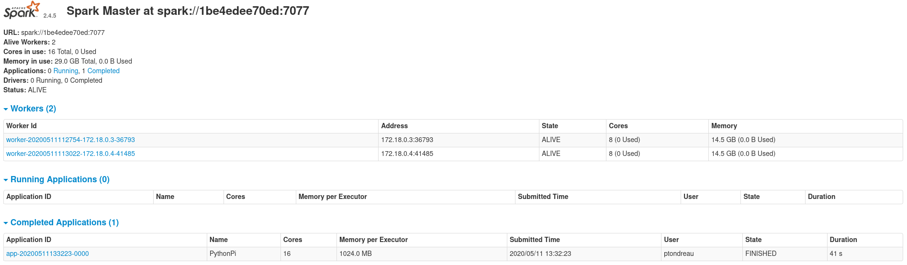
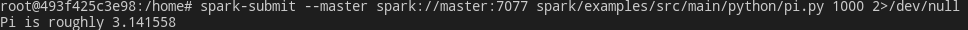

# Práctica 7 - Computación en la Nube

## Ejercicio 1 

**Haciendo uso de la documentación proporcionada en la sección Aplicaciones Cloud Native. Elabora un resumen (una página) en la que definas el concepto de Apliación Cloud Native**

El término de Aplicaciones Cloud Native se refiere a la forma en la que se crean las aplicaciones. Este tipo de aplicaciones, se forman como un conjunto de servicios que son independientes, por lo tanto la aplicación puede estar separada en diferentes partes.

El uso de esta arquitectura para el diseño de aplicaciones puede suponer las siguientes ventajas:

* Escalabilidad: Mediante el uso de tecnologías como la contenerización, el despliegue en horizontal se realiza de una forma muy sencilla

* Velocidad de Despliegue: Integrándose cada vez más estrategias de CI/CD, las empresas pueden desplegar rápidamente un cambio en desarrollo a la aplicación final. 

Por lo tanto, podemos concluir que las Aplicaciones Cloud Native, están diseñadas para que los desarrolladores puedan desplegar más rápidamente, de esta forma permitiendo realizar cambios que requieren los usuario de forma más rápida. También permite que cuando la carga de trabajo sea mayor, sea posible escalar de forma sencilla los servicios en ejecución. Estos aspectos son muy importantes, dado que actualmente las empresas y el mercado se mueven muy rápidamente y las aplicaciones deben de estar preparadas para dichos cambios.

Además, gracias a grandes empresas como Google y Amazon, el despliegue de servicios en la nube se ha convertido en una tarea fácil de realizar, ofreciendo precios muy asequibles que se basan en el uso de la infraestructura ofrecida.

## Ejercicio 2

**El documento *Chapter 3. Designing Cloud Native Applications* recoge las características fundamentales para el diseño de una aplicación Cloud Native. Describe y documenta el diseño de la aplicación que permite realizar el procesamiento de una imagen en paralelo de manera que pueda considerarse una aplicación Cloud Native. Incorpora en el diseño los elementos que necesites incorporar del framework que has venido desarrollando en prácticas anteriores.**

El documento *Chapter 3. Designing Cloud Native Applications* nos presenta las características de una aplicación Cloud Native, dichas características se reparten en los siguientes puntos:

* Operational Excellence: se basa en cómo ejecutar, monitorizar y mejorar la aplicación a medida que avanza el tiempo y la forma de implementarlo es usando técnicas de DevOps.
    - Automatizar lo máximo posible
    - Monitorizar todo
    - Documentar todo
    - Realizar cambios incrementales
    - Diseño para fallos

* Security: el aspecto de la seguridad en los proveedores cloud está bastante controlado, dado que constan de un equipo de expertos que se aseguran de que la infraestructura sea segura, aun así, debemos de asegurarnos que la aplicación desarrollada también sea segura.

* Reliability and Availability: con fiabilidad se refiere a que la aplicación funcione aún ante la presencia de fallos, y con disponibilidad se refiere a que la aplicación esté disponible siempre que un usuario quiera acceder a ella.

* Scalability and Cost: estos dos conceptos van de la mano, cuando se diseña una aplicación Cloud Native no solo se debe de pensar en cómo escalar la apliación en el caso de necesitarlo, si no también como realizarlo de una forma que sea rentable.

Teniendo en consideración los puntos anteriormente mencionados, el diseño resultante del framework desarrollado es el siguiente.

### Diseño de la Aplicación



Para el diseño de la aplicación se ha decidido usar *Kubernetes*. Según su propia definición, *Kubernetes* es un sistema de orquestación de contenedores open-source para automatizar la implementación, el escalado y la administración de aplicaciones. Según esta definición puede parecer evidente que *Kubernetes* sea una de las tecnologías más usadas para el desarrollo y despliegue de aplicaciones Cloud Native.

A continuación se explicará más en detalle cada uno de los elementos que componen el diseño.

#### Cluster de Kubernetes

Como lo indica su nombre, se trata de un cluster de varias máquinas que ejecuta Kubernetes. En él, se encontrarán los diferentes elementos que podemos lanzar en Kubernetes, como lo son los Pods, los ReplicaSet, los Deployments, los Servicios, los Ingress y el IngressController.

Al definir los elementos anteriores de Kubernetes, este se ocupará de controlar el estado de los Pods, el tráfico de la Red, etc. Por lo tanto, no debemos de preocuparnos de si un Pod falla, puesto que si esto pasa, Kubernetes se encargará de lanzar un nuevo Pod para nuestro Servicio.

#### Ingress Controller

Este elementos permite acceso a los Ingress que se definan (en la imagen no se muestra, pero existe un Ingress para el Servicio Backend y otro para el Frontend) en el cluster. 

Los Ingress son objetos API que maneja el acceso externo a los servicios del cluster. Proporciona balanceo de carga, definición de rutas HTTP y HTTPS, terminación SSL y definir nombres para cada Servicio.

Además, el uso de Ingress e IngressController, permite ahorrar costes dado que de esta forma no es necesario asignar una IP pública a cada Servicio, se define un ruta para cada uno de los Servicios y se accede desde el balanceador de carga definido por el proveedor de infraestructura cloud.

#### Servicios

En el cluster de Kubernetes diseñado se lanzarán los siguientes servicios:

* Backend: servicio que ejecutará el servidor backend que se ha desarrollado. Dispone de dos Pods para mantener un nivel de disponibilidad mayor en caso de fallo de un Pod.

* Frontend: servicio que ejecutará el servidor frontend que se ha desarrollado en las prácticas. Dispone de dos Pods para mantener un nivel de disponibilidad mayor en caso de fallo de un Pod.

* Computación: servicio en el cual se lanzarán los programas que vayan definiendo los usuarios en la aplicación final. El número de pods que se le define puede ser variable dado que simula el cluster externo que se ha desarrollado en la práctica 2.

## Ejercicio 3

**Instala el entorno Apache Spark y ejecuta algún ejemplo sencillo en python.**

### Contenedor Docker

Como prueba inicial para familiarizarse con el entorno de Spark, se ha decidido probarlo mediante un contenedor de Docker que también contiene un Jupyter Notebook para poder usarlo. La forma de ejecutar el contenedor es de la siguiente forma:

```sh
docker run -d -p 80:8888 -v $PWD:/home/jovyan/work --name spark jupyter/pyspark-notebook
```

Una vez en ejecución el contenedor, navegamos a http://localhost y obtenemos el siguiente resultado.



Creaamos un Jupyter Notebook y ejecutamos el siguiente ejemplo que nos ofrece Spark desde su repositorio de [Github](https://github.com/apache/spark/blob/master/examples/src/main/python/ml/kmeans_example.py).



### Máquina Local

Ahora que hemos podido comprobar el funcionamiento de Spark, procederemos a ejecutar un cluster de Spark mediante contenedores Docker y le enviaremos el código a ejecutar. Para conseguirlo se ha seguido este [tutorial](https://medium.com/@thiagolcmelo/submitting-a-python-job-to-apache-spark-on-docker-b2bd19593a06), la diferencia con el tutorial es que usaremos la versión estable más reciente de Spark (2.4.5).

Una vez creada la imagen Docker con el Dockerfile que se encuentra en [spark-docker](spark-docker/Dockerfile), creamos una red para los contenedores Spark mediante el siguiente comando.

* `docker network create --driver bridge spark-network`

Seguidamente creamos un contenedor master y dos workers, usando los siguientes comandos respectivamente.

* `docker run -d -t --name master --network spark-network pierresimt/spark`
y `docker exec master start-master` 

* `docker run -d -t --name worker-X --network spark-network pierresimt/spark`
y `docker exec worker-X start-slave spark://master:7077`

El resultado de ejecutar los comandos anteriores y navegando a la IP del contenedor master es el siguiente:



Para comprobar que todo funciona correctamente, lanzaremos uno de los ejemplos que nos ofree Spark. Para lanzar el ejemplo, lo realizaremos de la siguiente forma: `./spark/bin/spark-submit --master spark://172.18.0.2:7077 spark/examples/src/main/python/pi.py 1000 2>/dev/null`



Cuando termine su ejecución finalmente tendremos:



Y en la consola, obtendremos el resultado del ejemplo ejecutado:

